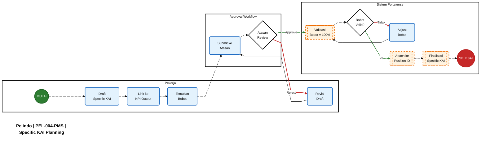
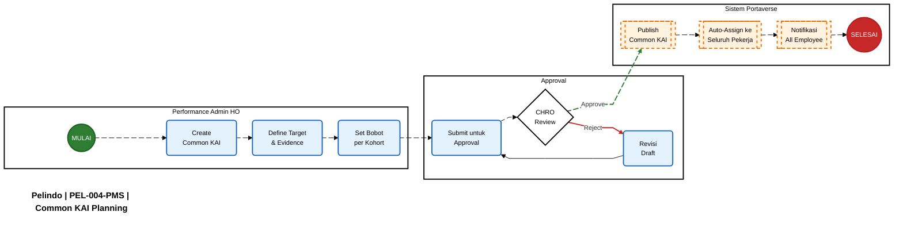
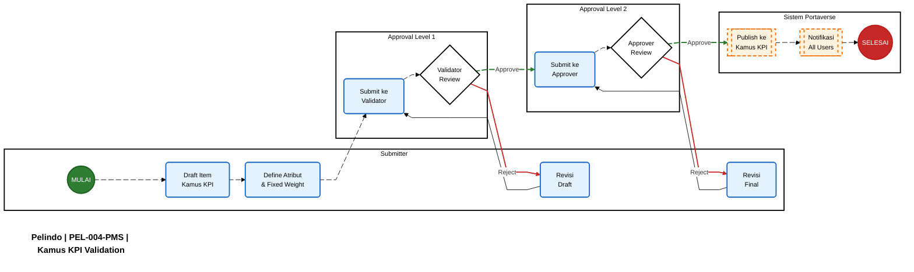

# Pelindo | PEL-004-PMS | Employee Performance Management System

<aside>
📋

**Document Control**

- **Version:** 5.0.0 (Edition)
- **Last Updated:** 04 Desember 2025
- **Author:** Performance Management Team
- **Status:** Final Draft
</aside>

---

# Glossary (Daftar Istilah)

| **Istilah** | **Definisi** |
| --- | --- |
| **KPI Impact** | KPI Korporat yang berasal dari KPI Output Direktur Utama. Bersifat identik untuk seluruh pekerja, hanya bobot yang berbeda per kohort. Menempel ke *Employee Number*. |
| **KPI Output** | KPI individu yang mengukur hasil kerja spesifik posisi/jabatan. Dapat di-cascade ke bawahan. Menempel ke *Position Master Variant ID*. |
| **KAI (Key Activity Indicators)** | Indikator aktivitas operasional untuk monitoring progress harian/mingguan/bulanan. Terdiri dari *Specific KAI* (per jabatan) dan *Common KAI* (seluruh pekerja). |
| **Performance Tree** | Struktur hierarkis KPI yang dialokasikan ke posisi/jabatan untuk perencanaan dan monitoring kinerja. |
| **Kamus KPI (KPI Dictionary)** | Katalog/library item KPI terstandarisasi yang dapat digunakan sebagai referensi saat perencanaan KPI. |
| **Owner** | Pemilik tunggal KPI Output yang bertanggung jawab mengisi realisasi dan pencapaian target. |
| **Collaborator** | Pekerja yang memiliki *child KPI* hasil cascading dari parent KPI. Masing-masing memiliki item KPI sendiri dengan target sendiri. |
| **Shared Owner** | Pekerja yang di-assign berbagi tanggung jawab pada 1 item KPI Output yang sama. Tidak dapat mengisi realisasi, mendapat score sama dengan Owner. |
| **P-KPI** | Sistem eksternal (KPI Korporat) yang menjadi master data untuk KPI Impact dan KPI Output level BOD hingga BOD-1. |
| **MDM (Master Data Management)** | Sistem Cloudera yang menjadi sumber master data untuk organisasi dan data pekerja. |
| **Kohort (Cohort)** | Pengelompokan pekerja berdasarkan level tanggung jawab (BOD, BOD-1, BOD-2, BOD-3, BOD-4) untuk kalibrasi yang fair. |
| **Direct Cascade** | Metode penurunan KPI dimana realisasi child berkontribusi langsung (di-sum) ke parent. Wajib satuan sama. |
| **Indirect Cascade** | Metode penurunan KPI dimana realisasi child tidak otomatis berkontribusi ke parent. |
| **Performance HQ** | Modul admin untuk konfigurasi bobot KPI per kohort, manage Common KAI, dan override KPI. |
| **Fixed Weight** | Bobot item KPI dari Kamus KPI yang tidak dapat diubah oleh pekerja/atasan. |
| **Cut-off** | Tanggal batas penarikan data untuk periode monitoring. Standar: tanggal 25 setiap bulan. |
| **Polarity** | Arah pengukuran KPI: *Maximize* (lebih tinggi lebih baik) atau *Minimize* (lebih rendah lebih baik). |
| **BSC Perspective** | Perspektif Balanced Scorecard: Financial, Customer, Internal Process, Learning & Growth. |

---

# Diagram Overview BRD

```mermaid
%%{init: {
  'layout': 'dagre',
  'theme': 'base',
  'look': 'classic',
  'flowchart': { 'curve': 'linear', 'nodeSpacing': 40, 'rankSpacing': 50 },
  'themeVariables': { 'primaryColor': '#fff8e8', 'edgeLabelBackground':'#ffffff', 'fontSize': '12px'}
}}%%
flowchart LR
  classDef processTitle fill:#ffffff,stroke:none,font-size:16px,font-weight:bold,color:#000000;
  classDef startNode fill:#2e7d32,stroke:#1b5e20,stroke-width:2px,color:#fff,shape:circle;
  classDef endNode fill:#c62828,stroke:#b71c1c,stroke-width:2px,color:#fff,shape:circle;
  classDef userTask fill:#e3f2fd,stroke:#1565c0,stroke-width:2px,rx:5,ry:5,color:#000;
  classDef serviceTask fill:#fff3e0,stroke:#ef6c00,stroke-width:2px,rx:5,ry:5,stroke-dasharray: 5 5,color:#000;
  classDef subProcess fill:#f3e5f5,stroke:#7b1fa2,stroke-width:2px,rx:5,ry:5,stroke-dasharray: 5,color:#000;
  classDef gateway fill:#ffffff,stroke:#000000,stroke-width:2px,shape:rhombus,color:#000;
  classDef dataObject fill:#f5f5f5,stroke:#616161,stroke-width:1px,stroke-dasharray: 2 2,shape:note,color:#000;
  classDef errorEvent fill:#ffccbc,stroke:#d84315,stroke-width:2px,shape:hexagon,color:#b71c1c;

  TitleNode["Pelindo | PEL-004-PMS | BRD Overview"]
  class TitleNode processTitle

  subgraph SEC1 ["Section 1: Jenis KPI"]
    S1A["Definisi &<br>Struktur KPI"]:::userTask
    S1B["Atribut KPI<br>Impact/Output/KAI"]:::userTask
    S1C["Aturan<br>KPI Impact"]:::userTask
  end

  subgraph SEC2 ["Section 2: Perencanaan KPI"]
    S2A["Planning<br>Workflow"]:::subProcess
    S2B["Cascading<br>Mechanism"]:::subProcess
    S2C["Owner &<br>Collaborator"]:::userTask
    S2D["Pembobotan<br>Scoring"]:::userTask
  end

  subgraph SEC3 ["Section 3: Monitoring KPI"]
    S3A["Pengisian<br>Realisasi"]:::subProcess
    S3B["Approval<br>Workflow"]:::subProcess
    S3C["Scoring<br>Proporsional"]:::serviceTask
  end

  subgraph SEC4 ["Section 4-6: Admin & Dictionary"]
    S4A["Performance<br>HQ"]:::userTask
    S4B["Common KAI<br>Management"]:::userTask
    S4C["Kamus KPI<br>Validation"]:::subProcess
  end

  S1A e1@--> S1B
  S1B e2@--> S1C
  S1C e3@--> S2A
  S2A e4@--> S2B
  S2B e5@--> S2C
  S2C e6@--> S2D
  S2D e7@--> S3A
  S3A e8@--> S3B
  S3B e9@--> S3C
  S3C e10@--> S4A
  S4A --> S4B
  S4B --> S4C

  e1@{ animate: true }
  e2@{ animate: true }
  e3@{ animate: true }
  e4@{ animate: true }
  e5@{ animate: true }
  e6@{ animate: true }
  e7@{ animate: true }
  e8@{ animate: true }
  e9@{ animate: true }
  e10@{ animate: true }

  style SEC1 stroke:#1565c0,stroke-width:2px
  style SEC2 stroke:#2e7d32,stroke-width:2px
  style SEC3 stroke:#ef6c00,stroke-width:2px
  style SEC4 stroke:#7b1fa2,stroke-width:2px
```

---

# Context & Prinsip Utama

<aside>
⚠️

**PRINSIP PERFORMANCE SCORING:**

Performance Score dihitung **100% dari KPI** (Impact + Output + KAI) **tanpa komponen behavior atau 360 assessment**.

| Periode | Formula |
| --- | --- |
| **End-State (2026+)** | Impact + Output + KAI = 100% |
| **Masa Transisi Q4 2025** | 40% Impact + 60% Output (tanpa KAI) |

Behavior evaluation dan 360 assessment **dipisahkan sepenuhnya** dari performance calculation.

</aside>

---

# Section 1: Jenis KPI

## 1.1 Definisi & Struktur KPI

### 1.1.1 Tujuan

Menetapkan struktur hierarkis KPI tiga tingkat untuk pengukuran kinerja yang komprehensif.

### 1.1.2 Ruang Lingkup

Berlaku untuk seluruh pekerja Pelindo dari level BOD hingga Staff.

### 1.1.3 Penegasan Penting

<aside>
📌

**Prinsip KPI Impact:**

- **KPI Impact = KPI Output Direktur Utama** (KPI Korporat)
- **Seluruh pekerja di perusahaan memiliki item-item KPI Impact yang identik** (sama persis)
- KPI Impact bersifat corporate-wide dan tidak berbeda antar kohort atau fungsi
- Yang berbeda antar kohort adalah **bobot** KPI Impact, bukan item-nya
</aside>

### 1.1.4 Definisi Struktur

| **Aspek** | **KPI Impact** | **KPI Output** | **KAI** |
| --- | --- | --- | --- |
| **Definisi** | KPI Korporat (KPI Output Direktur Utama) | KPI hasil kerja spesifik posisi | Indikator aktivitas operasional |
| **Scope** | Corporate/Business | Individual/Position | Operational |
| **Target** | Semua pekerja (item identik) | Spesifik per posisi | Spesifik/Common |
| **Attachment** | Employee Number | Position Master Variant ID | Position ID / Employee Number |
| **Frequency** | Quarterly | Monthly/Quarterly | Weekly/Monthly |
| **Master Data** | P-KPI | P-KPI (BOD-1) & Portaverse (BOD-2+) | Portaverse |

### 1.1.5 Kriteria Validasi

| No | Kriteria | Ketentuan |
| --- | --- | --- |
| 1 | Total Bobot Jenis | KPI Impact + KPI Output + KAI = **100%** |
| 2 | Total Bobot Item | Dalam setiap jenis KPI = **100%** |
| 3 | KPI Impact | **Identik** untuk seluruh pekerja (item sama, bobot berbeda) |
| 4 | KPI Output | Spesifik per posisi/jabatan |
| 5 | KAI | Specific per posisi ATAU Common untuk seluruh pekerja |

---

### 1.1.6 Tabel Atribut KPI Impact

| **Atribut** | **Tipe Data** | **Mandatory** | **Contoh Value** |
| --- | --- | --- | --- |
| Title | Text | Ya | "Net Income" |
| Description | Rich Text | Ya | "Laba bersih perusahaan setelah pajak" |
| Target Value | Number | Ya | 25000000000 (25 Miliar) |
| Target Unit | Text | Ya | "IDR (Rupiah)" |
| Polarity | Enum | Ya | "Maximize" / "Minimize" |
| Monitoring Frequency | Enum | Ya | "Quarterly" |
| Perspective | Enum | Ya | "Financial Performance" |
| Evidence Requirement | Text | Ya | "Laporan Keuangan Audited Q1/Q2/Q3/Q4" |
| Created By | User | Auto | "Corporate Strategic Planning Team" |
| Approved By | User | Auto | "Board of Directors" |
| Is Active | Boolean | Ya | True |
| Applicable Period | Date Range | Ya | "2026-01-01 to 2026-12-31" |

---

### 1.1.7 Tabel Atribut KPI Output

| **Atribut** | **Tipe Data** | **Mandatory** | **Contoh Value** |
| --- | --- | --- | --- |
| Title | Text | Ya | "Container Throughput Terminal Nilam" |
| Description | Rich Text | Ya | "Total volume petikemas yang dibongkar dan dimuat" |
| Target Value | Number | Ya | 50000 |
| Target Unit | Text | Ya | "TEUs (Twenty-foot Equivalent Units)" |
| Polarity | Enum | Ya | "Maximize" / "Minimize" |
| Monitoring Frequency | Enum | Ya | "Monthly" / "Quarterly" |
| BSC Perspective | Enum | Ya | "Customer" / "Financial" / "Internal Process" / "Learning" |
| Cascading Method | Enum | Ya | "Direct" / "Indirect" |
| Ownership Type | Enum | Ya | "Specific" / "Shared" / "Common" |
| Owner | User (Single) | Ya | "Budi Santoso (Dept Head Terminal Operations)" |
| Collaborators | User (Multiple) | Tidak | ["Ani Wijaya", "Citra Dewi", "Dwi Putra"] |
| Parent KPI | Relation | Tidak | "KPI Impact: Operational Excellence" |
| Child KPIs | Relation (Multiple) | Tidak | ["Shift A Throughput", "Shift B Throughput"] |
| Position Mapping | Relation | Ya | "Department Head - Terminal Operations" |
| Function Mapping | Enum | Ya | "Operations" |
| Cohort Mapping | Enum | Ya | "Manager" / "BOD-2" |
| Evidence Requirement | Text | Ya | "TOS Monthly Report, Daily Logs, Dashboard Screenshot" |
| Weight (Bobot) | Number (%) | Ya | 30 |
| Is From Dictionary | Boolean | Auto | True / False |
| Created By | User | Auto | "Budi Santoso" |
| Approved By | User | Auto | "Eko Prasetyo (GM Operations)" |
| Is Active | Boolean | Ya | True |

---

### 1.1.8 Tabel Atribut Key Activity Indicators (KAI)

| **Atribut** | **Tipe Data** | **Mandatory** | **Contoh Value** |
| --- | --- | --- | --- |
| Title | Text | Ya | "Customer Satisfaction Rate" |
| Description | Rich Text | Ya | "Persentase feedback positif dari pelanggan" |
| Target Value | Number | Ya | 90 |
| Target Unit | Text | Ya | "%" (Percentage) |
| Polarity | Enum | Ya | "Maximize" |
| Nature of Work | Enum | Ya | "Routine" / "Non-routine" |
| Monitoring Frequency | Enum | Ya | "Weekly" / "Monthly" |
| BSC Perspective | Enum | Ya | "Customer" |
| Ownership Type | Enum | Ya | "Specific" / "Common" |
| Owner | User (Single) / All Employees | Ya | "Siti Nurhaliza" ATAU "All Employees" |
| Parent KPI | Relation | Tidak | "KPI Output: Customer Satisfaction Score Monthly" |
| Position Mapping | Relation | Kondisional* | "Officer - Customer Service" (jika Specific) |
| Function Mapping | Enum | Kondisional* | "Customer Service" (jika Specific) |
| Cohort Mapping | Enum | Kondisional* | "Officer / BOD-4" (jika Specific) |
| Evidence Requirement | Text | Ya | "Screenshot dashboard, Report, Complaint logs" |
| Weight (Bobot) | Number (%) | Ya | 15 |
| Is Common KAI | Boolean | Ya | False / True |
| Auto Assign to Employee | Boolean | Kondisional | True (jika Common KAI) |
| Created By | User | Auto | "Siti Nurhaliza" atau "Performance Admin" |
| Approved By | User | Auto | "Rina Kusuma (Supervisor CS)" |
| Is Active | Boolean | Ya | True |

**Catatan:** *Kondisional: Wajib jika Ownership Type = "Specific", tidak wajib (NULL) jika "Common"

---

## 1.2 Aturan KPI Impact

### 1.2.1 Tujuan

Memastikan seluruh pekerja memiliki item KPI Impact yang identik dan mencegah deviasi.

### 1.2.2 Prosedur

**Langkah 1: Master Data Centralization**

- KPI Impact hanya dibuat dan di-manage di **P-KPI** (sistem eksternal)
- Portaverse hanya **consume** data via API sync
- Tidak ada fitur create/edit KPI Impact di Portaverse

**Langkah 2: Auto-Assignment**

- Saat P-KPI sync KPI Impact baru, Portaverse otomatis assign ke seluruh pekerja aktif
- Assignment dilakukan di background tanpa approval
- Pekerja hanya dapat **lihat**, tidak dapat edit/delete

**Langkah 3: Immutable di Level Pekerja**

- Pekerja tidak dapat remove KPI Impact dari Performance Tree
- Atasan tidak dapat approve/reject KPI Impact
- Yang dapat diubah: **bobot per kohort** (via Performance HQ)

**Langkah 4: Validation**

- Sistem validasi saat finalisasi: semua pekerja harus memiliki KPI Impact identik
- Jika terdeteksi deviasi → block finalisasi + alert ke Performance Admin

### 1.2.3 Exception Handling

| Kondisi | Penanganan |
| --- | --- |
| P-KPI down saat sync | Performance Admin manual override via Performance HQ |
| Manual override | Wajib justification + approval Chief HR Officer |
| Setelah P-KPI normal | Sistem auto-reconcile + notify jika ada discrepancy |

---

# Section 2: Perencanaan KPI

## 2.1 Perencanaan KPI Impact

### 2.1.1 Tujuan

Menetapkan prosedur perencanaan dan sinkronisasi KPI Impact dari P-KPI ke Portaverse.

### 2.1.2 Diagram Proses Bisnis

```mermaid
%%{init: {
  'layout': 'dagre',
  'theme': 'base',
  'look': 'classic',
  'flowchart': { 'curve': 'linear', 'nodeSpacing': 30, 'rankSpacing': 30 },
  'themeVariables': { 'primaryColor': '#fff8e8', 'edgeLabelBackground':'#ffffff', 'fontSize': '12px'}
}}%%
flowchart LR
  classDef processTitle fill:#ffffff,stroke:none,font-size:16px,font-weight:bold,color:#000000;
  classDef startNode fill:#2e7d32,stroke:#1b5e20,stroke-width:2px,color:#fff,shape:circle;
  classDef endNode fill:#c62828,stroke:#b71c1c,stroke-width:2px,color:#fff,shape:circle;
  classDef userTask fill:#e3f2fd,stroke:#1565c0,stroke-width:2px,rx:5,ry:5,color:#000;
  classDef serviceTask fill:#fff3e0,stroke:#ef6c00,stroke-width:2px,rx:5,ry:5,stroke-dasharray: 5 5,color:#000;
  classDef subProcess fill:#f3e5f5,stroke:#7b1fa2,stroke-width:2px,rx:5,ry:5,stroke-dasharray: 5,color:#000;
  classDef gateway fill:#ffffff,stroke:#000000,stroke-width:2px,shape:rhombus,color:#000;
  classDef dataObject fill:#f5f5f5,stroke:#616161,stroke-width:1px,stroke-dasharray: 2 2,shape:note,color:#000;
  classDef errorEvent fill:#ffccbc,stroke:#d84315,stroke-width:2px,shape:hexagon,color:#b71c1c;

  TitleNode["Pelindo | PEL-004-PMS | KPI Impact Planning"]
  class TitleNode processTitle

  subgraph Corporate ["Corporate Strategic"]
    Start(("MULAI")):::startNode
    CS1["Penetapan<br>Strategi Korporasi"]:::userTask
    CS2["Definisi<br>KPI Impact"]:::userTask
    CS3["Submit ke<br>P-KPI"]:::userTask
  end

  subgraph HR ["Performance Admin"]
    HR1["Konfigurasi Bobot<br>per Kohort"]:::userTask
    HR2["Validasi Total<br>Bobot 100%"]:::serviceTask
    HR3{"Bobot<br>Valid?"}:::gateway
    HR4["Penyesuaian<br>Bobot"]:::userTask
    HR5["Validasi<br>Config"]:::userTask
    HR6["Sosialisasi"]:::userTask
  end

  subgraph PKPI ["Sistem P-KPI"]
    PK1[["Validasi &<br>Simpan"]]:::serviceTask
    PK2{"BOD<br>Selaras?"}:::gateway
    PK3["BOD:<br>Approval"]:::userTask
    PK4[["Generate<br>Master Data"]]:::serviceTask
  end

  subgraph PV ["Sistem Portaverse"]
    PV1[["Sinkronisasi<br>Data"]]:::serviceTask
    PV2{"Sync<br>OK?"}:::gateway
    PV3["Error<br>Handling"]:::errorEvent
    PV4[["Mapping Bobot<br>per Level"]]:::serviceTask
    PV5[["Generate<br>Performance Tree"]]:::serviceTask
    EMP["All Employee:<br>Akses KPI"]:::userTask
    End(("SELESAI")):::endNode
  end

  Start e1@--> CS1
  CS1 e2@--> HR1
  HR1 e3@--> HR2
  HR2 e4@--> HR3
  HR3 -->|Tidak| HR4
  HR4 --> HR2
  HR3 e5@-->|Ya| CS2
  CS2 e6@--> CS3
  CS3 e7@--> PK1
  PK1 e8@--> PK2
  PK2 -->|Tidak| CS2
  PK2 e9@-->|Ya| PK3
  PK3 e10@--> PK4
  PK4 e11@--> PV1
  PV1 e12@--> PV2
  PV2 -->|Tidak| PV3
  PV3 --> PV1
  PV2 e13@-->|Ya| PV4
  PV4 e14@--> PV5
  PV5 e15@--> HR5
  HR5 e16@--> HR6
  HR6 e17@--> EMP
  EMP e18@--> End

  e1@{ animate: true }
  e2@{ animate: true }
  e3@{ animate: true }
  e4@{ animate: true }
  e5@{ animate: true }
  e6@{ animate: true }
  e7@{ animate: true }
  e8@{ animate: true }
  e9@{ animate: true }
  e10@{ animate: true }
  e11@{ animate: true }
  e12@{ animate: true }
  e13@{ animate: true }
  e14@{ animate: true }
  e15@{ animate: true }
  e16@{ animate: true }
  e17@{ animate: true }
  e18@{ animate: true }

  linkStyle 4 stroke:#c62828,stroke-width:2px
  linkStyle 9 stroke:#c62828,stroke-width:2px
  linkStyle 14 stroke:#c62828,stroke-width:2px
  linkStyle 5 stroke:#2e7d32,stroke-width:2px
  linkStyle 10 stroke:#2e7d32,stroke-width:2px
  linkStyle 16 stroke:#2e7d32,stroke-width:2px

  style Corporate stroke:#000000,stroke-width:2px
  style HR stroke:#000000,stroke-width:2px
  style PKPI stroke:#000000,stroke-width:2px
  style PV stroke:#000000,stroke-width:2px
```

### 2.1.3 Langkah-langkah Prosedur

| No | Aktor | Aktivitas | Output |
| --- | --- | --- | --- |
| 1 | Corporate Strategic | Penetapan strategi korporasi awal tahun | Dokumen strategi |
| 2 | Performance Admin | Konfigurasi bobot KPI per kohort via Performance HQ | Konfigurasi bobot |
| 3 | Performance Admin | Validasi total bobot = 100% | Status validasi |
| 4 | Corporate Strategic | Definisi item KPI Impact | Draft KPI Impact |
| 5 | Corporate Strategic | Submit ke P-KPI | Data KPI di P-KPI |
| 6 | P-KPI | Validasi dan simpan data | Master data validated |
| 7 | BOD | Review keselarasan dan approval | Approval status |
| 8 | P-KPI | Generate master data | Master data final |
| 9 | Portaverse | Sinkronisasi data dari P-KPI | Data tersinkronisasi |
| 10 | Portaverse | Mapping bobot per level | Bobot terpetakan |
| 11 | Portaverse | Generate Performance Tree | Tree terbentuk |
| 12 | Performance Admin | Validasi konfigurasi | Config validated |
| 13 | Performance Admin | Sosialisasi ke seluruh pekerja | Pekerja terinformasi |
| 14 | All Employee | Akses KPI Impact di sistem | KPI accessible |

---

## 2.2 Perencanaan KPI Output

### 2.2.1 Tujuan

Menetapkan prosedur perencanaan KPI Output yang fleksibel dengan approval workflow.

### 2.2.2 Diagram Proses Bisnis

```mermaid
%%{init: {
  'layout': 'dagre',
  'theme': 'base',
  'look': 'classic',
  'flowchart': { 'curve': 'linear', 'nodeSpacing': 30, 'rankSpacing': 30 },
  'themeVariables': { 'primaryColor': '#fff8e8', 'edgeLabelBackground':'#ffffff', 'fontSize': '12px'}
}}%%
flowchart LR
  classDef processTitle fill:#ffffff,stroke:none,font-size:16px,font-weight:bold,color:#000000;
  classDef startNode fill:#2e7d32,stroke:#1b5e20,stroke-width:2px,color:#fff,shape:circle;
  classDef endNode fill:#c62828,stroke:#b71c1c,stroke-width:2px,color:#fff,shape:circle;
  classDef userTask fill:#e3f2fd,stroke:#1565c0,stroke-width:2px,rx:5,ry:5,color:#000;
  classDef serviceTask fill:#fff3e0,stroke:#ef6c00,stroke-width:2px,rx:5,ry:5,stroke-dasharray: 5 5,color:#000;
  classDef subProcess fill:#f3e5f5,stroke:#7b1fa2,stroke-width:2px,rx:5,ry:5,stroke-dasharray: 5,color:#000;
  classDef gateway fill:#ffffff,stroke:#000000,stroke-width:2px,shape:rhombus,color:#000;
  classDef dataObject fill:#f5f5f5,stroke:#616161,stroke-width:1px,stroke-dasharray: 2 2,shape:note,color:#000;
  classDef errorEvent fill:#ffccbc,stroke:#d84315,stroke-width:2px,shape:hexagon,color:#b71c1c;

  TitleNode["Pelindo | PEL-004-PMS | KPI Output Planning"]
  class TitleNode processTitle

  subgraph User ["Pekerja / Atasan"]
    Start(("MULAI")):::startNode
    Draft{"Siapa<br>Draft?"}:::gateway
    A1["Atasan:<br>Draft KPI"]:::userTask
    B1["Bawahan:<br>Draft KPI"]:::userTask
    A2["Tentukan Owner<br>& Collaborator"]:::userTask
    W1["Draft Bobot<br>Item"]:::userTask
    Revise["Revisi<br>Draft"]:::userTask
  end

  subgraph Approval ["Approval Workflow"]
    Submit["Submit untuk<br>Approval"]:::userTask
    Review{"Atasan<br>Review"}:::gateway
  end

  subgraph System ["Sistem Portaverse"]
    ValItems[["Validasi:<br>Item Complete"]]:::serviceTask
    ValItem[["Validasi: Bobot<br>Item = 100%"]]:::serviceTask
    ItemOK{"Bobot Item<br>Valid?"}:::gateway
    AdjItem["Adjust<br>Bobot Item"]:::userTask
    ValCat[["Validasi: Bobot<br>Jenis = 100%"]]:::serviceTask
    CatOK{"Bobot Jenis<br>Valid?"}:::gateway
    AdjCat["Adjust<br>Bobot Jenis"]:::userTask
    Attach[["Attach ke<br>Position ID"]]:::serviceTask
    Final[["Finalisasi<br>KPI Output"]]:::serviceTask
    Cascade{"Perlu<br>Cascade?"}:::gateway
    CascDown[["Cascade ke<br>Bawahan"]]:::serviceTask
    End(("SELESAI")):::endNode
  end

  Start e1@--> Draft
  Draft -->|Atasan| A1
  Draft -->|Bawahan| B1
  A1 e2@--> A2
  B1 --> A2
  A2 e3@--> W1
  W1 e4@--> Submit
  Submit e5@--> Review
  Review -->|Reject| Revise
  Revise --> Submit
  Review e6@-->|Approve| ValItems
  ValItems e7@--> ValItem
  ValItem e8@--> ItemOK
  ItemOK -->|Tidak| AdjItem
  AdjItem --> ValItem
  ItemOK e9@-->|Ya| ValCat
  ValCat e10@--> CatOK
  CatOK -->|Tidak| AdjCat
  AdjCat --> ValCat
  CatOK e11@-->|Ya| Attach
  Attach e12@--> Final
  Final e13@--> Cascade
  Cascade -->|Tidak| End
  Cascade e14@-->|Ya| CascDown
  CascDown e15@--> End

  e1@{ animate: true }
  e2@{ animate: true }
  e3@{ animate: true }
  e4@{ animate: true }
  e5@{ animate: true }
  e6@{ animate: true }
  e7@{ animate: true }
  e8@{ animate: true }
  e9@{ animate: true }
  e10@{ animate: true }
  e11@{ animate: true }
  e12@{ animate: true }
  e13@{ animate: true }
  e14@{ animate: true }
  e15@{ animate: true }

  linkStyle 7 stroke:#c62828,stroke-width:2px
  linkStyle 12 stroke:#c62828,stroke-width:2px
  linkStyle 15 stroke:#c62828,stroke-width:2px
  linkStyle 9 stroke:#2e7d32,stroke-width:2px
  linkStyle 13 stroke:#2e7d32,stroke-width:2px
  linkStyle 17 stroke:#2e7d32,stroke-width:2px

  style User stroke:#000000,stroke-width:2px
  style Approval stroke:#000000,stroke-width:2px
  style System stroke:#000000,stroke-width:2px
```

### 2.2.3 Langkah-langkah Prosedur

| No | Aktor | Aktivitas | Output |
| --- | --- | --- | --- |
| 1 | Atasan/Bawahan | Draft KPI Output (fleksibel) | Draft KPI |
| 2 | Atasan | Tentukan Owner & Collaborator | Assignment |
| 3 | Pekerja | Draft bobot per item KPI | Bobot draft |
| 4 | Pekerja | Submit untuk approval atasan | Submission |
| 5 | Atasan | Review dan approve/reject | Decision |
| 6 | Sistem | Validasi kelengkapan item | Validation result |
| 7 | Sistem | Validasi total bobot item = 100% | Validation result |
| 8 | Sistem | Validasi total bobot jenis = 100% | Validation result |
| 9 | Sistem | Attach ke Position Master Variant ID | Position mapping |
| 10 | Sistem | Finalisasi KPI Output | KPI finalized |
| 11 | Sistem | Cascade ke bawahan (jika diperlukan) | Cascaded KPI |

---

## 2.3 Cascading KPI

### 2.3.1 Aturan Cascading

| **Aspek** | **Direct Cascade** | **Indirect Cascade** |
| --- | --- | --- |
| **Definisi** | Realisasi child berkontribusi langsung ke parent | Realisasi child tidak otomatis ke parent |
| **Satuan** | **Wajib sama** dengan parent | Boleh berbeda |
| **Akumulasi** | Realisasi child di-SUM ke parent | Tidak ada akumulasi |
| **Target** | Tidak harus akumulatif | Independen |

<aside>
⚠️

**Constraint untuk Direct Cascading:**

Untuk KPI Output dengan metode **Direct Cascading**, sistem harus merestriksi perubahan **satuan target** di item turunan agar realisasi dapat di-**sum** ke parent.

</aside>

### 2.3.2 Fixed vs Progressive Target

| **Tipe Target** | **Deskripsi** | **Contoh** |
| --- | --- | --- |
| **Fixed Target** | Target **sama** sepanjang tahun per periode monitoring | "Customer Satisfaction Rate ≥ 90%" setiap bulan |
| **Progressive Target** | Target **spesifik** di tiap periode monitoring (dapat berbeda per bulan/triwulan) | Q1 = 80%, Q2 = 85%, Q3 = 90%, Q4 = 95% |

**Konfigurasi:**

- Tipe target ditentukan saat **perencanaan KPI**
- Untuk Progressive Target, user harus input target per periode
- Achievement dihitung berdasarkan target periode yang berlaku

### 2.3.3 Vertical Alignment Assurance

<aside>
📊

**Requirement:**

Sistem harus memastikan ada flow/connection KPI yang jelas antara level untuk strategic alignment (Group Head → Department Head → Manager → Staff).

</aside>

**Warning System:**

| **Kondisi** | **Warning Message** |
| --- | --- |
| Gap dalam cascading | "⚠️ Gap terdeteksi: KPI Impact 'Net Income' tidak memiliki KPI Output turunan di level Manager" |
| Orphan KPI | "⚠️ Orphan KPI: KPI Output 'Terminal Throughput' tidak memiliki parent KPI" |
| Direct link ke staff | "⚠️ KPI Impact terhubung langsung ke Staff tanpa cascading KPI Output di level menengah" |

### 2.3.2 Contoh Akumulasi Realisasi KPI Output Direct

<aside>
📊

**Skenario:**

GM Operations (Owner) memiliki KPI Output "Regional Container Throughput" dengan target 200,000 TEUs/bulan. KPI ini di-cascade secara **Direct** ke 3 Dept Head sebagai Collaborator.

</aside>

**Tabel Perhitungan Akumulasi Realisasi:**

| **Posisi** | **Role** | **Target (TEUs)** | **Realisasi (TEUs)** | **Achievement** |
| --- | --- | --- | --- | --- |
| Dept Head Terminal A | Collaborator | 80,000 | 78,000 | 97.5% |
| Dept Head Terminal B | Collaborator | 90,000 | 85,000 | 94.4% |
| Dept Head Terminal C | Collaborator | 50,000 | 47,000 | 94.0% |
| **TOTAL AKUMULASI** |  | **220,000** | **210,000** |  |
| **GM Operations** | **Owner** | **200,000** | **210,000** (auto-sum) | **105%** |

**Catatan Penting:**

- Target total child (220,000) ≠ Target parent (200,000) → **Valid** (target tidak harus akumulatif)
- Realisasi child (210,000) → **Otomatis update ke parent**
- Achievement parent dihitung dari realisasi akumulasi vs target parent

---

## 2.4 Skema Owner, Collaborator & Shared Owner

### 2.4.1 Definisi Peran

| **Peran** | **Definisi** | **Dapat Isi Realisasi?** | **Perhitungan Score** |
| --- | --- | --- | --- |
| **Owner** | Pemilik tunggal KPI Output | ✅ Ya | Achievement × Bobot item sendiri |
| **Collaborator** | Pemilik child KPI hasil cascade | ✅ Ya (KPI sendiri) | Achievement KPI sendiri × Bobot sendiri |
| **Shared Owner** | Berbagi tanggung jawab 1 item KPI | ❌ Tidak | Achievement Owner × Bobot sendiri |

### 2.4.2 Opsi Penanganan Pekerja di Posisi Sama (Non-Struktural)

Untuk pekerja di posisi yang sama (misal: 3 Officer di 1 departemen), ada 2 opsi penanganan KPI:

| **Aspek** | **Opsi 1: Owner + Shared Owner** | **Opsi 2: Duplikasi KPI Output** |
| --- | --- | --- |
| **Struktur** | 1 pekerja menjadi **Owner**, lainnya **Shared Owner** | Setiap pekerja memiliki **item KPI sendiri** (semua jadi Owner) |
| **Pengisian Realisasi** | Hanya Owner yang mengisi realisasi | Masing-masing mengisi realisasi sendiri |
| **Achievement** | Semua mendapat achievement % **yang sama** | Score dihitung **independen** per pekerja |
| **Target** | Sama untuk semua | Bisa berbeda (sesuai porsi tanggung jawab) |
| **Bobot Item** | Bisa berbeda di masing-masing Performance Tree | Bisa berbeda per pekerja |

### 2.4.3 Contoh Perhitungan Score

**Skenario:** KPI Output "Throughput Container" dengan Achievement 105%

| **Pekerja** | **Peran** | **Achievement** | **Bobot Item** | **Kontribusi ke Score** |
| --- | --- | --- | --- | --- |
| Dept Head (Budi) | Owner | 105% | 50% | 105% × 50% = **52.5%** |
| Peer (Ani) | Shared Owner | 105% (ikut Owner) | 40% | 105% × 40% = **42%** |

---

## 2.5 Pembobotan Performance Scoring

### 2.5.1 Dual-Level Weight System

**Tingkat 1: Bobot Jenis KPI (dikonfigurasi per Kohort)**

| Kohort | KPI Impact | KPI Output | KAI | Total |
| --- | --- | --- | --- | --- |
| BOD-1 (Group Head) | 40% | 40% | 20% | 100% |
| BOD-2 (Dept Head) | 30% | 40% | 30% | 100% |
| BOD-3 (Manager) | 20% | 40% | 40% | 100% |
| BOD-4 (Officer) | 10% | 30% | 60% | 100% |

**Tingkat 2: Bobot Item KPI (dalam setiap jenis)**

- Total bobot semua item dalam 1 jenis = **100%**

### 2.5.2 Contoh Perhitungan Lengkap (Officer)

| **Jenis KPI** | **Item** | **Bobot Item** | **Bobot Jenis** | **Kontribusi Final** |
| --- | --- | --- | --- | --- |
| **KPI Output** (30%) | Item Output A | 50% | 30% | 50% × 30% = **15%** |
| Item Output B | 50% | 50% × 30% = **15%** |  |  |
| **KAI** (60%) | KAI Specific 1 | 40% | 60% | 40% × 60% = **24%** |
| KAI Specific 2 | 40% | 40% × 60% = **24%** |  |  |
| Common KAI | 20% | 20% × 60% = **12%** |  |  |
| **KPI Impact** (10%) | (8 items, given) | 100% | 10% | **10%** |
| **TOTAL** | **100%** |  |  |  |

---

# Section 3: Monitoring KPI

## 3.1 Pengisian Realisasi KPI Output

### 3.1.1 Diagram Proses Bisnis

```mermaid
%%{init: {
  'layout': 'dagre',
  'theme': 'base',
  'look': 'classic',
  'flowchart': { 'curve': 'linear', 'nodeSpacing': 30, 'rankSpacing': 30 },
  'themeVariables': { 'primaryColor': '#fff8e8', 'edgeLabelBackground':'#ffffff', 'fontSize': '12px'}
}}%%
flowchart LR
  classDef processTitle fill:#ffffff,stroke:none,font-size:16px,font-weight:bold,color:#000000;
  classDef startNode fill:#2e7d32,stroke:#1b5e20,stroke-width:2px,color:#fff,shape:circle;
  classDef endNode fill:#c62828,stroke:#b71c1c,stroke-width:2px,color:#fff,shape:circle;
  classDef userTask fill:#e3f2fd,stroke:#1565c0,stroke-width:2px,rx:5,ry:5,color:#000;
  classDef serviceTask fill:#fff3e0,stroke:#ef6c00,stroke-width:2px,rx:5,ry:5,stroke-dasharray: 5 5,color:#000;
  classDef subProcess fill:#f3e5f5,stroke:#7b1fa2,stroke-width:2px,rx:5,ry:5,stroke-dasharray: 5,color:#000;
  classDef gateway fill:#ffffff,stroke:#000000,stroke-width:2px,shape:rhombus,color:#000;
  classDef dataObject fill:#f5f5f5,stroke:#616161,stroke-width:1px,stroke-dasharray: 2 2,shape:note,color:#000;
  classDef errorEvent fill:#ffccbc,stroke:#d84315,stroke-width:2px,shape:hexagon,color:#b71c1c;

  TitleNode["Pelindo | PEL-004-PMS | KPI Output Monitoring"]
  class TitleNode processTitle

  subgraph Owner ["Owner KPI Output"]
    Start(("AWAL<br>BULAN")):::startNode
    Daily["Daily<br>Operations"]:::userTask
    Compile["Compile Data<br>dari Collaborator"]:::userTask
    Input["Input<br>Realisasi"]:::userTask
    Upload["Upload<br>Evidence"]:::userTask
    Revise["Revisi Data<br>& Evidence"]:::userTask
  end

  subgraph Collab ["Collaborator"]
    Monitor["Monitor<br>Progress"]:::userTask
    Update["Update Data<br>ke Owner"]:::userTask
  end

  subgraph System ["Sistem Portaverse"]
    Calc[["Hitung<br>Achievement"]]:::serviceTask
    Distribute[["Distribute Score<br>Owner & Collab"]]:::serviceTask
    Dashboard[["Update<br>Dashboard"]]:::serviceTask
    IsChild{"Child dari<br>Parent?"}:::gateway
    UpdParent[["Update<br>Parent KPI"]]:::serviceTask
  end

  subgraph Approval ["Atasan (GM)"]
    Submit["Submit<br>ke GM"]:::userTask
    Review{"GM<br>Review"}:::gateway
    Feedback["Feedback<br>Detail"]:::userTask
    End(("SELESAI")):::endNode
  end

  Start e1@--> Daily
  Daily --> Monitor
  Monitor --> Update
  Update e2@--> Compile
  Compile e3@--> Input
  Input e4@--> Upload
  Upload e5@--> Calc
  Calc e6@--> Submit
  Submit e7@--> Review
  Review -->|Reject| Feedback
  Feedback --> Revise
  Revise --> Upload
  Review e8@-->|Approve| Distribute
  Distribute e9@--> Dashboard
  Dashboard e10@--> IsChild
  IsChild -->|Tidak| End
  IsChild e11@-->|Ya| UpdParent
  UpdParent e12@--> End

  e1@{ animate: true }
  e2@{ animate: true }
  e3@{ animate: true }
  e4@{ animate: true }
  e5@{ animate: true }
  e6@{ animate: true }
  e7@{ animate: true }
  e8@{ animate: true }
  e9@{ animate: true }
  e10@{ animate: true }
  e11@{ animate: true }
  e12@{ animate: true }

  linkStyle 8 stroke:#c62828,stroke-width:2px
  linkStyle 11 stroke:#2e7d32,stroke-width:2px
  linkStyle 15 stroke:#2e7d32,stroke-width:2px

  style Owner stroke:#000000,stroke-width:2px
  style Collab stroke:#000000,stroke-width:2px
  style System stroke:#000000,stroke-width:2px
  style Approval stroke:#000000,stroke-width:2px
```

### 3.1.2 Timeline Pengisian Realisasi

| **Frequency** | **Formulir Tersedia** | **Deadline Input** | **Deadline Review** | **Auto-Approve** |
| --- | --- | --- | --- | --- |
| **KPI Output Monthly** | Tanggal 1 | Tanggal 5 | Tanggal 10 | Tanggal 10 |
| **KPI Output Quarterly** | Tanggal 1 bulan pertama Q baru | Tanggal 10 | Tanggal 15 | Tanggal 15 |
| **KAI Weekly** | Senin | Minggu 23:59 | Rabu 23:59 | Rabu 23:59 |
| **KAI Monthly** | Tanggal 1 | Tanggal 5 | Tanggal 10 | Tanggal 10 |

**Cut-off Periode:** Tanggal 26 bulan sebelumnya - Tanggal 25 bulan berjalan

---

## 3.2 Skenario Approval Realisasi

### 3.2.1 Lima Skenario Approval

| **No** | **Skenario** | **Deskripsi** | **Action Atasan** | **Status Akhir** |
| --- | --- | --- | --- | --- |
| 1 | **Approve Langsung** | Atasan setuju dengan data realisasi tanpa perubahan | Klik "Approve" | Approved |
| 2 | **Reject with Comment** | Atasan menemukan ketidaksesuaian data atau evidence tidak memadai | Klik "Reject" + **Wajib** isi catatan penolakan | Rejected - Awaiting Revision |
| 3 | **Request Clarification** | Atasan membutuhkan informasi tambahan sebelum approve | Klik "Request Clarification" + isi pertanyaan | Pending Clarification |
| 4 | **Adjust & Approve** | Atasan menemukan error minor, adjust nilai langsung | Edit nilai + **Wajib** isi justification + Approve | Approved (Adjusted) |
| 5 | **Auto-Approve (Timeout)** | Atasan tidak review hingga batas waktu | Tidak ada (sistem otomatis) | Auto-Approved |

### 3.2.2 Contoh Feedback Penolakan

<aside>
✅

**Good Feedback:**

"Data throughput 52,500 TEUs tidak sesuai dengan TOS report yang di-attach (tercatat 51,200 TEUs). Mohon cek ulang sumber data dan re-submit dengan evidence yang konsisten."

</aside>

<aside>
❌

**Bad Feedback:**

"Data salah, revisi."

</aside>

---

## 3.3 KPI Impact Monitoring

### 3.3.1 Sumber Data Realisasi

| **Aspek** | **Ketentuan** |
| --- | --- |
| **Master Data** | KPI Impact di-manage sepenuhnya di **P-KPI** (sistem eksternal) |
| **Role Portaverse** | Hanya **consume** data via API sync |
| **Pengisian Manual** | Tidak ada pengisian manual realisasi KPI Impact di Portaverse |

### 3.3.2 Sync Mechanism

- P-KPI push data realisasi KPI Impact ke Portaverse setiap akhir triwulan
- API sync otomatis: **D+5** setelah akhir triwulan (5 Jan, 5 Apr, 5 Jul, 5 Okt)
- Portaverse auto-distribute achievement score ke seluruh pekerja aktif

### 3.3.3 Timeline Monitoring KPI Impact

| **Triwulan** | **Periode Monitoring** | **Report Available** |
| --- | --- | --- |
| Q1 | Januari - Maret | 5 April |
| Q2 | April - Juni | 5 Juli |
| Q3 | Juli - September | 5 Oktober |
| Q4 | Oktober - Desember | 5 Januari tahun berikutnya |

---

## 3.4 Scoring Proporsional (Mutasi/Rotasi)

### 3.4.1 Business Logic Threshold Tanggal 15

| **Tanggal Mutasi** | **Logika** | **Bulan Mutasi Menjadi Tanggung Jawab** |
| --- | --- | --- |
| Tanggal 1 - 15 | ≤ 15 | **Posisi Baru** |
| Tanggal 16 - 31 | > 15 | **Posisi Lama** |

### 3.4.2 Formula Perhitungan Proporsional

$$text{Skor Triwulanan} = frac{(text{Skor Posisi Lama} times text{Bulan Lama}) + (text{Skor Posisi Baru} times text{Bulan Baru})}{3}$$

### 3.4.3 Contoh Perhitungan: Mutasi Tanggal 10 Mei (Q2)

**Distribusi Bulan:**

- Posisi Lama (Officer): April = **1 bulan**
- Posisi Baru (Supervisor): Mei + Juni = **2 bulan**

| **Posisi** | **Bulan** | **Score Bulanan** | **Jumlah Bulan** | **Kontribusi** |
| --- | --- | --- | --- | --- |
| Officer (Lama) | April | 103.3% | 1 | 103.3% × 1 = 103.3% |
| Supervisor (Baru) | Mei | 106.1% | 2 | (106.1% + 105.7%) ÷ 2 × 2 = 211.8% |
| Juni | 105.7% |  |  |  |
| **TOTAL** | **3** | (103.3% + 211.8%) ÷ 3 = **105.03%** |  |  |

### 3.4.4 Contoh Perhitungan: Mutasi Tanggal 20 Mei (Q2)

**Distribusi Bulan:**

- Posisi Lama (Officer): April + Mei = **2 bulan**
- Posisi Baru (Supervisor): Juni = **1 bulan**

| **Posisi** | **Bulan** | **Score Bulanan** | **Jumlah Bulan** | **Kontribusi** |
| --- | --- | --- | --- | --- |
| Officer (Lama) | April | 105% | 2 | (105% + 103%) ÷ 2 × 2 = 208% |
| Mei | 103% |  |  |  |
| Supervisor (Baru) | Juni | 108% | 1 | 108% × 1 = 108% |
| **TOTAL** | **3** | (208% + 108%) ÷ 3 = **105.33%** |  |  |

---

# Section 4: Perencanaan KAI (Key Activity Indicators)

## 4.1 Perencanaan Specific KAI

### 4.1.1 Diagram Proses Bisnis

### 4.1.2 Langkah-langkah Prosedur

| **No** | **Aktor** | **Aktivitas** | **Output** |
| --- | --- | --- | --- |
| 1 | Pekerja | Draft Specific KAI sesuai nature of work | Draft KAI |
| 2 | Pekerja | Link KAI ke KPI Output terkait (opsional) | KAI terlink |
| 3 | Pekerja | Tentukan bobot per item KAI | Bobot draft |
| 4 | Pekerja | Submit untuk approval atasan | Submission |
| 5 | Atasan | Review dan approve/reject | Decision |
| 6 | Sistem | Validasi total bobot KAI = 100% | Validation result |
| 7 | Sistem | Attach ke Position ID pekerja | Position mapping |
| 8 | Sistem | Finalisasi Specific KAI | KAI finalized |

---

## 4.2 Perencanaan Common KAI

### 4.2.1 Diagram Proses Bisnis

### 4.2.2 Langkah-langkah Prosedur

| **No** | **Aktor** | **Aktivitas** | **Output** |
| --- | --- | --- | --- |
| 1 | Performance Admin HO | Create Common KAI item di Performance HQ | Draft Common KAI |
| 2 | Performance Admin HO | Define target value dan evidence requirement | Target & evidence defined |
| 3 | Performance Admin HO | Set bobot per kohort (dapat berbeda) | Bobot per kohort |
| 4 | Performance Admin HO | Submit untuk approval CHRO | Submission |
| 5 | CHRO | Review dan approve/reject | Decision |
| 6 | Sistem | Publish Common KAI | KAI published |
| 7 | Sistem | Auto-assign ke seluruh pekerja aktif | All employees assigned |
| 8 | Sistem | Notifikasi ke seluruh pekerja | Notification sent |

---

# Section 5: Performance Headquarter

## 5.1 Performance HQ - Admin Access

### 4.1.1 Fitur Performance HQ

| No | Fitur | Deskripsi |
| --- | --- | --- |
| 1 | Konfigurasi Bobot | Set bobot jenis KPI (Impact, Output, KAI) per kohort |
| 2 | Browse Jabatan | Navigasi berdasarkan struktur organisasi, fungsi, atau cohort |
| 3 | Lihat KPI | View current KPI Output dan KAI per jabatan |
| 4 | Tambah KPI | Add item KPI Output/KAI langsung ke jabatan (bypass approval) |
| 5 | Edit/Hapus KPI | Modify atau delete item KPI yang sudah ada |
| 6 | Common KAI | Create dan manage Common KAI untuk seluruh pekerja |
| 7 | Fixed Weight | Set bobot tetap untuk item dari Kamus KPI |

### 4.1.2 Business Rules

- Hanya **Performance Admin** dan **Super Admin** yang memiliki akses
- Perubahan berlaku langsung **tanpa approval atasan**
- Audit trail lengkap untuk setiap perubahan
- Perubahan hanya dalam **masa Perencanaan KPI**

---

## 5.2 Common KAI Management

### 4.2.1 Karakteristik Common KAI

| Aspek | Ketentuan |
| --- | --- |
| Attachment | Employee Number (bukan Position ID) |
| Berlaku untuk | Seluruh pekerja tanpa terkecuali |
| Assignment | Auto-assign saat onboard atau saat dibuat |
| Removal | Hanya oleh Performance Admin |
| Bobot | Dapat berbeda per kohort |

### 4.2.2 Contoh Common KAI

1. **Workplace Safety Compliance** — Semua pekerja wajib comply dengan safety protocol
2. **Attendance Rate ≥ 95%** — Semua pekerja wajib memenuhi attendance minimum
3. **Corporate Training Completion** — Semua pekerja wajib complete mandatory training

---

# Section 6: Kamus KPI (KPI Dictionary)

## 6.1 Definisi & Tujuan

<aside>
📚

**Kamus KPI** adalah katalog/library item KPI terstandarisasi yang dapat digunakan sebagai referensi saat perencanaan KPI. Item dari Kamus KPI telah melalui validasi dan dapat memiliki bobot tetap (Fixed Weight).

</aside>

### 6.1.1 Manfaat Kamus KPI

| **No** | **Manfaat** | **Tanggung Jawab** |
| --- | --- | --- |
| **Submitter** | Pekerja yang mengusulkan item Kamus KPI | Draft, define atribut, revisi |
| **Validator** | Performance Admin yang melakukan validasi pertama | Review definisi, target, evidence requirement |
| **Approver** | Performance Admin HO yang melakukan approval final | Final review, set Fixed Weight, publish |

---

## 6.3 Fixed Weight Items

### 6.3.1 Definisi

<aside>
🔒

**Fixed Weight** adalah bobot item KPI dari Kamus KPI yang **tidak dapat diubah** oleh pekerja atau atasan saat menggunakan item tersebut dalam Performance Tree.

</aside>

### 6.3.2 Karakteristik Fixed Weight

| **Aspek** | **Ketentuan** |
| --- | --- |
| **Siapa yang set** | Hanya **Performance Admin HO** via Kamus KPI |
| **Kapan di-set** | Saat approval item Kamus KPI |
| **Dapat diubah oleh** | Hanya Performance Admin HO |
| **User behavior** | Field bobot **read-only** di UI pekerja |
| **Indikator UI** | Icon 🔒 di samping nilai bobot |

### 6.3.3 Contoh Fixed Weight Items

| **Item Kamus KPI** | **Fixed Weight** | **Alasan** |
| --- | --- | --- |
| Workplace Safety Compliance | 10% | Mandatory untuk seluruh pekerja |
| Attendance Rate | 5% | Standar minimum kehadiran |
| Corporate Training Completion | 5% | Wajib training tahunan |
| Customer Satisfaction Score | 15% | Prioritas tinggi untuk fungsi CS |

---

# Section 7: KPI Tree (Visualisasi & Calendaring)

## 7.1 Visualisasi KPI Tree

### 7.1.1 Tujuan

Menyediakan tampilan visual hierarki KPI untuk memudahkan pemahaman cascading dan alignment.

### 7.1.2 Fitur Visualisasi

| **No** | **Fitur** | **Deskripsi** |
| --- | --- | --- |
| 1 | **Hierarchical View** | Tampilan tree dari KPI Impact → KPI Output → KAI |
| 2 | **Filter by Level** | Filter berdasarkan kohort/level organisasi |
| 3 | **Filter by Function** | Filter berdasarkan fungsi/direktorat |
| 4 | **Drill-down** | Klik item untuk melihat detail dan child KPI |
| 5 | **Color Coding** | Warna berbeda untuk status (on track, at risk, off track) |
| 6 | **Expand/Collapse** | Expand atau collapse branch dalam tree |

---

## 7.2 Calendaring & Scheduling

### 7.2.1 Annual Performance Calendar

| **Periode** | **Aktivitas** | **Deadline** |
| --- | --- | --- |
| **Desember Y-1** | Konfigurasi bobot per kohort | 31 Desember |
| **Januari W1-W2** | Perencanaan KPI Impact dari P-KPI | 15 Januari |
| **Januari W2-W4** | Perencanaan KPI Output & KAI | 31 Januari |
| **Februari W1** | Finalisasi & approval seluruh KPI | 7 Februari |
| **Bulanan** | Monitoring realisasi KPI Output & KAI | Tanggal 5 bulan berikutnya |
| **Triwulanan** | Review KPI Impact dari P-KPI | D+5 setelah akhir Q |
| **November** | Preparation tahun berikutnya | 30 November |

---

# Section 8: Roles & Access Control

## 8.1 Definisi Role

| **Role** | **Deskripsi** | **Deskripsi** |
| --- | --- | --- |
| 1 | **Standardisasi** | Memastikan KPI yang sama di berbagai posisi memiliki definisi dan measurement yang konsisten |
| 2 | **Efisiensi** | Pekerja dapat memilih dari library tanpa harus membuat KPI dari awal |
| 3 | **Quality Control** | KPI yang masuk Kamus telah divalidasi oleh Performance Admin |
| 4 | **Fixed Weight** | Bobot tertentu dapat dikunci sehingga tidak dapat diubah oleh pekerja |

---

## 6.2 Dual-Approval Workflow Kamus KPI

### 6.2.1 Diagram Proses Bisnis

### 6.2.2 Role dalam Dual-Approval

| **Role** | **Deskripsi** | **Populasi** |
| --- | --- | --- |
| **End-user** | Base role untuk seluruh pengguna PMS | Seluruh pekerja |
| **Executive** | Pengguna posisi BOD & BOD-1 | Direksi dan Direksi-1 |
| **Performance Admin** | Pengelola Kinerja Individu (Regional/Cabang) | Dept Head/Manager/Officer Pengelola Kinerja |
| **Performance Admin HO** | Pengelola Kinerja Individu (Holding) | Pengelola Kinerja di Head Office |

## 8.2 Access Matrix

| **Module** | **End-user** | **Executive** | **Perf Admin** | **Perf Admin HO** |
| --- | --- | --- | --- | --- |
| My Performance | ✅ Full | ✅ Full | ✅ Full | ✅ Full |
| My Team Performance | ✅ Full | ✅ Full | ✅ Full | ✅ Full |
| KPI Dictionary | ✅ Full | ✅ Full | ✅ Full | ✅ Full |
| Performance Tree | ❌ No | 👁️ View | ✅ Full | ✅ Full |
| Performance HQ | ❌ No | ❌ No | ✅ Scoped | ✅ Full |

---

# Section 6: Out of Scope

<aside>
🚫

**Item berikut TIDAK termasuk dalam scope BRD PEL-004-PMS 2025:**

</aside>

| No | Item | Alasan | Status |
| --- | --- | --- | --- |
| 1 | AI Recommendation for KPI | Belum prioritas 2025 | Future Enhancement |
| 2 | AI Agent for Kamus KPI | Manual oleh Validator | Future Enhancement |
| 3 | Daily KAI Monitoring | Hanya Weekly/Monthly | Removed |
| 4 | KPI Output Boundaries | Tidak ada min/max item | Removed |
| 5 | Behavior/360 dalam Score | Dipisahkan sepenuhnya | Separate Module |
| 6 | Target Setting Process | Dilakukan di P-KPI | External System |

---

# Appendix: Performance Scoring Examples

## A.1 Contoh Scoring End-State (Q1 2026)

**Profil:** Siti Nurhaliza, Customer Service Officer, Kohort BOD-4

| **Jenis KPI** | **Achievement** | **Bobot Jenis** | **Kontribusi** |
| --- | --- | --- | --- |
| KPI Impact | 104.6% | 10% | 10.46% |
| KPI Output | 103.75% | 30% | 31.13% |
| KAI | 105.91% | 60% | 63.55% |
| **TOTAL** |  | **100%** | **105.14%** |

**Kategori:** Exceed Expectations

## A.2 Contoh Scoring Masa Transisi (Q4 2025)

| **Jenis KPI** | **Achievement** | **Bobot Transisi** | **Kontribusi** |
| --- | --- | --- | --- |
| KPI Output (Existing) | 108% | 60% | 64.8% |
| KPI Impact (P-KPI) | 102% | 40% | 40.8% |
| **TOTAL** |  | **100%** | **105.6%** |

**Kategori:** Exceed Expectations

---

# Appendix B: Contoh Detail Performance Planning (Siti Nurhaliza)

## B.1 Profil Pekerja

| **Atribut** | **Value** |
| --- | --- |
| **Nama** | Siti Nurhaliza |
| **NIPP** | 12345678 |
| **Posisi** | Customer Service Officer |
| **Fungsi** | Customer Service |
| **Kohort** | BOD-4 (Officer) |
| **Atasan Langsung** | Rina Kusuma (Supervisor CS) |
| **Periode** | 2026 |

## B.2 Performance Tree Siti Nurhaliza

| **Jenis KPI** | **Item** | **Target** | **Bobot Item** | **Bobot Jenis** | **Kontribusi Final** |
| --- | --- | --- | --- | --- | --- |
| **KPI Impact** (10%) | Net Income | ≥ 25 Miliar | 40% | 10% | 4% |
|  | Customer Satisfaction Index | ≥ 90% | 30% |  | 3% |
|  | Operational Excellence | ≥ 95% | 30% |  | 3% |
| **KPI Output** (30%) | Customer Complaint Resolution Rate | ≥ 95% | 50% | 30% | 15% |
|  | First Call Resolution | ≥ 85% | 50% |  | 15% |
| **KAI** (60%) | Daily Customer Feedback Score | ≥ 4.5/5 | 40% | 60% | 24% |
|  | Response Time ≤ 5 min | ≥ 90% | 30% |  | 18% |
|  | Workplace Safety (Common) | 100% | 15% |  | 9% |
|  | Attendance Rate (Common) | ≥ 95% | 15% |  | 9% |
| **TOTAL** |  |  | **100%** | **100%** | **100%** |

---

# Appendix C: Business Requirement Items

| **BR-ID** | **Kategori** | **Requirement** | **Prioritas** | **Section Ref** |
| --- | --- | --- | --- | --- |
| BR-001 | KPI Structure | Sistem harus mendukung 3 jenis KPI: Impact, Output, KAI | Must Have | Section 1.1 |
| BR-002 | KPI Impact | KPI Impact harus identik untuk seluruh pekerja (item sama, bobot berbeda per kohort) | Must Have | Section 1.1.3 |
| BR-003 | KPI Impact | KPI Impact di-sync dari P-KPI, tidak dapat dibuat/edit di Portaverse | Must Have | Section 1.2 |
| BR-004 | KPI Output | KPI Output attach ke Position Master Variant ID | Must Have | Section 1.4 |
| BR-005 | Cascading | Sistem mendukung Direct Cascade (realisasi child di-sum ke parent) dan Indirect Cascade | Must Have | Section 2.3.1 |
| BR-006 | Cascading | Direct Cascade wajib satuan sama antara parent dan child | Must Have | Section 2.3.1 |
| BR-007 | Target | Sistem mendukung Fixed Target dan Progressive Target | Must Have | Section 2.3.2 |
| BR-008 | Alignment | Sistem memberikan warning untuk gap dalam vertical alignment cascading | Should Have | Section 2.3.3 |
| BR-009 | Ownership | Sistem mendukung 3 role: Owner, Collaborator, Shared Owner | Must Have | Section 2.4.1 |
| BR-010 | Ownership | Shared Owner tidak dapat mengisi realisasi, mendapat score sama dengan Owner | Must Have | Section 2.4.1 |
| BR-011 | Bobot | Dual-level weight: Bobot Jenis (per kohort) dan Bobot Item (dalam jenis) | Must Have | Section 2.5.1 |
| BR-012 | Bobot | Total bobot jenis = 100%, total bobot item dalam jenis = 100% | Must Have | Section 1.1.5 |
| BR-013 | Monitoring | Cut-off periode: tanggal 26 bulan sebelumnya - tanggal 25 bulan berjalan | Must Have | Section 3.1.2 |
| BR-014 | Approval | 5 skenario approval: Approve, Reject, Request Clarification, Adjust & Approve, Auto-Approve | Must Have | Section 3.2.1 |
| BR-015 | Approval | Reject wajib disertai catatan penolakan | Must Have | Section 3.2.1 |
| BR-016 | Scoring | Scoring proporsional untuk mutasi/rotasi berdasarkan threshold tanggal 15 | Must Have | Section 3.4.1 |
| BR-017 | KAI | Sistem mendukung Specific KAI (per posisi) dan Common KAI (seluruh pekerja) | Must Have | Section 4.1, 4.2 |
| BR-018 | Common KAI | Common KAI auto-assign ke seluruh pekerja aktif | Must Have | Section 4.2 |
| BR-019 | Admin | Performance HQ untuk admin: konfigurasi bobot, browse jabatan, manage KPI | Must Have | Section 5.1 |
| BR-020 | Admin | Performance Admin dapat bypass approval untuk add/edit KPI | Must Have | Section 5.1 |
| BR-021 | Kamus KPI | Dual-approval workflow untuk Kamus KPI (Validator → Approver) | Should Have | Section 6.2 |
| BR-022 | Fixed Weight | Item Kamus KPI dapat memiliki Fixed Weight (tidak dapat diubah pekerja) | Should Have | Section 6.3 |
| BR-023 | Visualization | KPI Tree visualization dengan hierarchical view, filter, drill-down, color coding | Should Have | Section 7.1 |
| BR-024 | Integration | API sync dengan P-KPI untuk KPI Impact dan realisasi (D+5 setelah akhir triwulan) | Must Have | Section 3.3 |
| BR-025 | Integration | Data pekerja dan organisasi dari MDM (Cloudera) | Must Have | Section 1.1.4 |
| BR-026 | Access | Role-based access: End-user, Executive, Performance Admin, Performance Admin HO | Must Have | Section 8.1 |
| BR-027 | Scoring | Performance Score = 100% KPI (tanpa behavior/360 assessment) | Must Have | Context |
| BR-028 | Transisi | Masa transisi Q4 2025: 40% Impact + 60% Output (tanpa KAI) | Must Have | Context |

---

<aside>
📋

**Document End**

*BRD Employee Performance Management System - SOP Edition*

*Version 5.0.0 | 04 Desember 2025*
